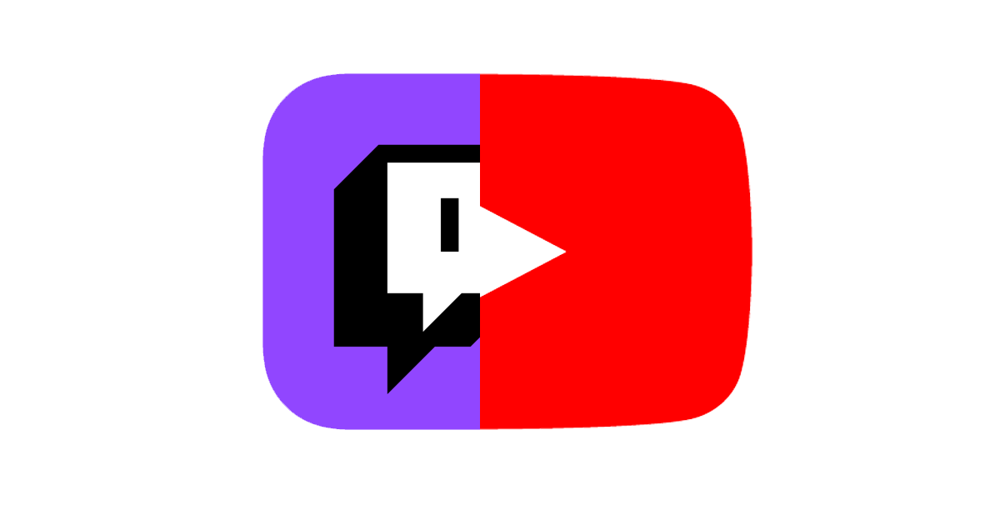

  

# YouItch_LiveChat
Create a Node.js webserver and send out YouTube and Twitch Live Chat (combine it together)

# Demo Video
<iframe width="560" height="315" src="https://www.youtube.com/embed/WbOLsRc5sPU" title="YouTube video player" frameborder="0" allow="accelerometer; autoplay; clipboard-write; encrypted-media; gyroscope; picture-in-picture" allowfullscreen></iframe>

# Features
* Fully customizable CSS
* Fully customizable Script
* Works in All Stream (No need to be your own stream)
* Lightweight

# Setup
Coming soon

# License
See the [LICENSE](./LICENSE) file for licensing information.

